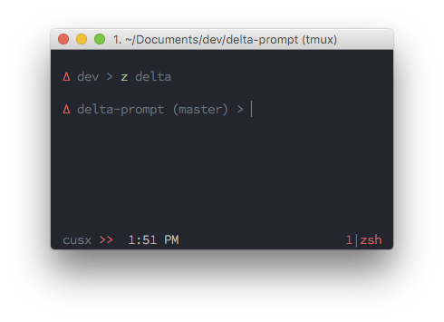

# Delta Prompt

> A very minimal ZSH prompt



## Information

To achieve the look and feel in the screenshot:

1. [Oxygen Color Scheme](https://github.com/cusxio/dotfiles/blob/master/iTerm/Oxygen.itermcolors)

2. [Tmux](https://github.com/cusxio/dotfiles/blob/master/tmux/theme.sh) configuration

3. [Source Code Pro Light](https://github.com/adobe-fonts/source-code-pro) @ 14pt

4. [zsh-syntax-highlighting](https://github.com/zsh-users/zsh-syntax-highlighting)

## Install

### [zplug](https://github.com/zplug/zplug)

```bash
# ~/.zplug/init.zsh

zplug "cusxio/delta-prompt", use:delta.zsh
```

## License

MIT © Jonathan Chan
